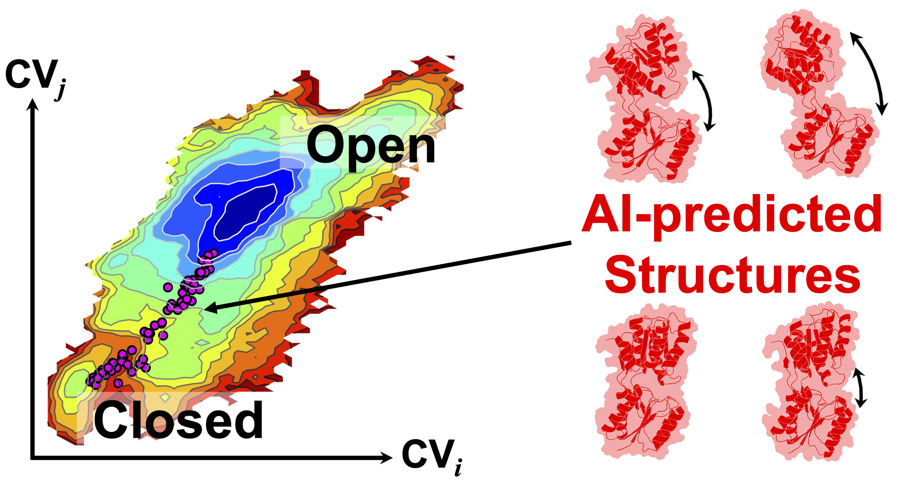
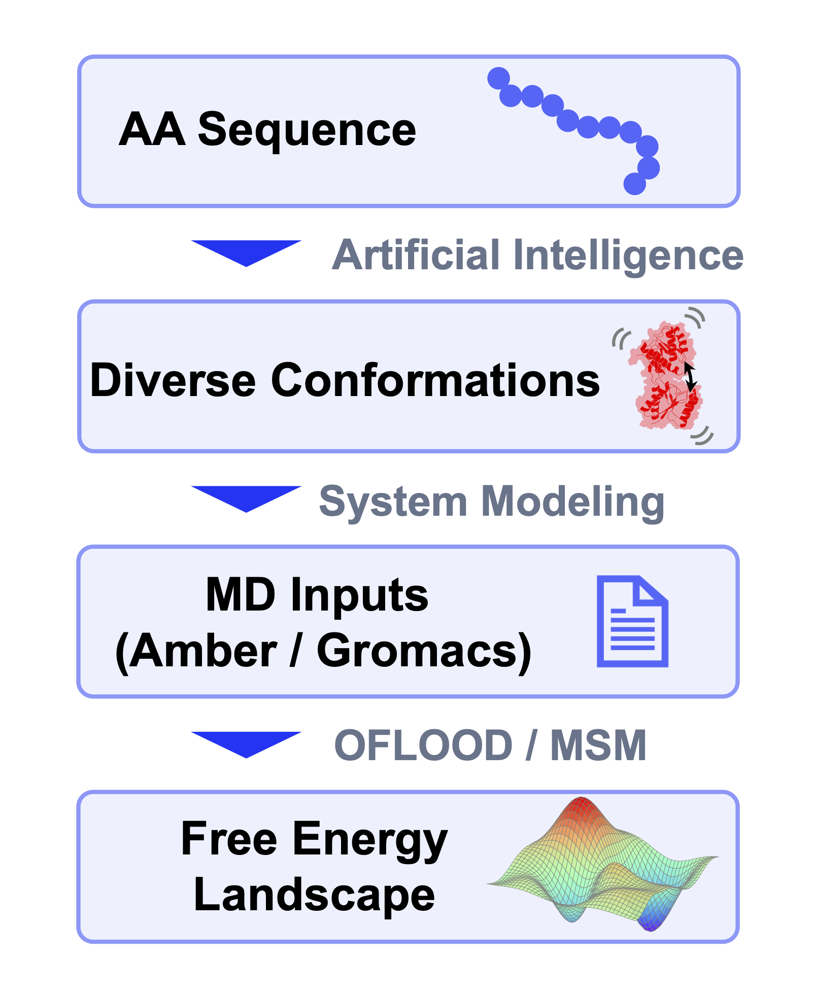

<p align="center"><br><br></p>

# Welcome to AI-Assisted OFLOOD

<p align="center"><br></p>

## Features



The AI-Assisted OFLOOD toolkit outputs the free-energy landscape (FEL) of a target protein using either its amino acid sequence or user-prepared AI-predicted structures as input. The process of this toolkit consist of the following three processes : (i) generating AI-predicted structures, (ii) modeling input files for MD simulations, and (iii) running the Outlier FLOODing (OFLOOD) and building Markov state model (MSM) for the FEL calculation.

<br><br><br><br><br><br><br><br><br><br><br><br><br>

## Requirements

**【Required】**

- **Conda** (Miniconda or Anaconda)
- **GROMACS** or **AMBER** (At least one MD engine must be available on your system)

**【Optional】**

- **LocalColabFold** (For fully automated execution including structure prediction)

> [!TIP]
> With LocalColabFold installed, the tutorial runs fully automatically from sequence to free-energy landscape via `./run.sh all`. Without it, you can use structures predicted by **any tool** (AlphaFold, ESMFold, etc.) — just place your PDB files in `inputs/prediction/`.

> [!NOTE]
> Python dependencies and internal tools (e.g., PROCHECK) will be installed automatically in the Quick Start steps.

## ⚡ Quick Start

### 1. Install Dependencies

Building a Conda environment is **strictly required** to ensure reproducibility.

```bash
git clone https://github.com/aoki-toma/AI-Assisted_OFLOOD.git
cd AI-Assisted_OFLOOD
conda env create -f environment.yml
conda activate AI-Assisted_OFLOOD
 
 # Install internal dependencies (e.g., download and compile PROCHECK)
./setup.sh
```

> [!NOTE]
> If `conda env create` fails (e.g., on ARM-based systems), please refer to the Troubleshooting section in our [Documentation](docs/manual_en.md) for workarounds.

> [!NOTE]
> If you plan to use AI structure prediction (Stage 1), please install LocalColabFold manually according to their [official instructions](https://github.com/YoshitakaMo/localcolabfold). You will set its path in Step 3.

### 2. Run the Tutorial

To verify your environment, we recommend running a pre-configured tutorial. Choose the example corresponding to your system and MD engine:

| Example | System | MD Engine | Directory |
|---------|--------|-----------|-----------|
| Soluble protein | Ribose Binding Protein | GROMACS | `examples/soluble_protein_for_gromacs/` |
| Soluble protein | Ribose Binding Protein | AMBER | `examples/soluble_protein_for_amber/` |
| Membrane protein | Nark Transporter | GROMACS | `examples/membrane_protein_for_gromacs/` |

```bash
# For example:
cd examples/soluble_protein_for_gromacs/
```

### 3. Configure Project

**3a.** Open `run.sh` and set the absolute paths:

```bash
AA_OFLOOD_ROOT="/absolute/path/to/AI-Assisted_OFLOOD"
CONDA_DIR="/path/to/conda"
GROMACS_DIR="/path/to/gromacs"
# or AMBER_DIR="/path/to/amber"

COLABFOLD_DIR="/path/to/localcolabfold" # Leave empty if not using build-in structure generation
```

**3b.** Open `para_conf.sh` and set the MD engine and execution command:

```bash
ENGINE="gromacs"
GMX_CMD="gmx_mpi"    # Your GROMACS command (gmx, gmx_mpi, etc.)
```

**3c.** Set `SUBMIT_SCRIPT_FILE` in `para_conf.sh`:

```bash
# Local PC (for quick testing):
SUBMIT_SCRIPT_FILE="${AA_OFLOOD_ROOT}/submit_scripts/local.sh"

# HPC cluster (copy and customize the template):
# SUBMIT_SCRIPT_FILE="${AA_OFLOOD_ROOT}/submit_scripts/my_cluster.sh"
```

Then open the chosen script and ensure the MD engine is loaded correctly inside `setup_env_md()`.

> [!NOTE]
> For HPC environments, see [Documentation](docs/manual_en.md) to create your own adapter script.

### 4. Execute the Pipeline

```bash
# Run the workflow (this submits real HPC jobs)
./run.sh all
# and
./run.sh 7 --mode run
```

> [!NOTE]
> Because this tutorial uses a real, complex protein system from the paper, the MD jobs are computationally intensive. You only need to let it run for the first 1-2 cycles to verify that your HPC pipeline and environment are fully functional.

---

## 🚀 Applying to Your Own Research

Running `./run.sh all` out-of-the-box is only possible for the tutorial. Applying this tool to a novel protein requires implementing three user scripts:

- **System modeling** (`user_scripts/prepare_md.sh`) — Building your MD system (force field, solvation, ion placement)
- **Energy minimization** (`user_scripts/minimize.sh`) — Designing your relaxation protocol (multi-step minimization, equilibration, etc.)
- **Collective Variables** (`user_scripts/compute_cv.sh`) — Defining and computing CVs appropriate for your protein

To start your own research project, use the empty template:

```bash
cp -r templates/base_project_for_gromacs/ my_project/
# If using Amber, copy base_project_for_amber/ instead
cd my_project/
```

Then, please carefully read the **Documentation** below to learn how to implement these scripts.

---

## 📚 Documentation

For advanced configuration, HPC setup, and detailed stage-by-stage specifications, please see our complete manual:

- **[English](docs/manual_en.md)**
- **[日本語](docs/manual_jp.md)**

---

## References & Citation

If you use this software in your research, please cite:

**1. Methodology and Application:**
> Aoki, T., & Harada, R. (2026). Free Energy Calculation Method Based on Enhanced Sampling of Diverse Protein Conformations Predicted by Artificial Intelligence. *The Journal of Physical Chemistry Letters*.
> DOI: [10.1021/acs.jpclett.6c00466](https://pubs.acs.org/doi/10.1021/acs.jpclett.6c00466)

**2. Software**
> Aoki, T., & Harada, R. (2026). [coming soon!!] *Bioinformatics*.
> DOI: [coming soon!!](nothing)
