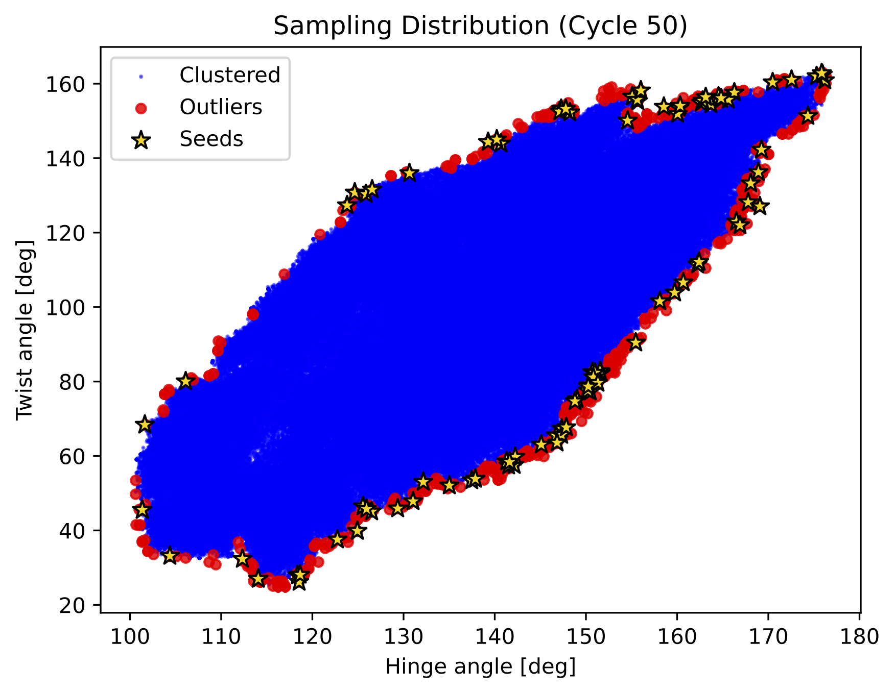
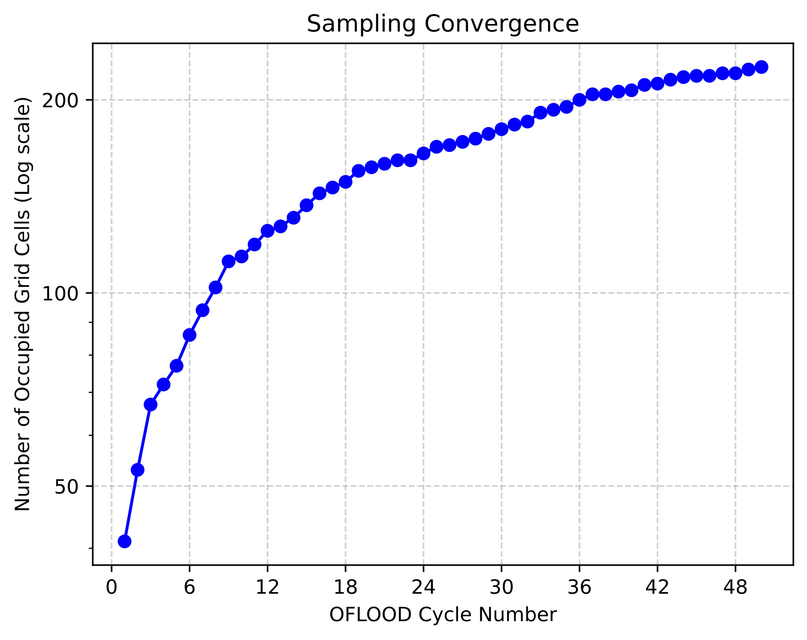

# 📦 Installation

## Required Software

| Category | Software / Library | Version |
|---|---|---|
| **Language** | Bash | 4.0+ |
| | Python | 3.11+ |
| **MD Engine** | GROMACS | 2021.0+ |
| | Amber | 22.0+ |
| **Tools** | AmberTools | 22.0+ |
| | PROCHECK | |
| | ColabFold (Optional) | |
| **Libraries** | MDAnalysis | |
| | deeptime | |
| | scikit-learn | |
| | pandas | |
| | numpy | |
| | matplotlib | |
| | ParmEd | |

## Installation Steps

Setting up a **Conda (Miniconda / Anaconda) environment is strictly required** to run this tool.

```bash
git clone https://github.com/mikant2/AI-Assisted_OFLOOD.git
cd AI-Assisted_OFLOOD

conda env create -f environment.yml
conda activate AI-Assisted_OFLOOD
./setup.sh
```

> [!NOTE]
> If `conda env create` fails, please refer to [🔧 Troubleshooting](#-troubleshooting).

## Verifying the Installation

```bash
python3 -c "import MDAnalysis, deeptime, sklearn, pandas, parmed; print('OK')"
bash --version
gmx --version   # Or for Amber: pmemd --version
```

# ⚙️ Project Setup

This manual uses GROMACS (`base_project_for_gromacs`) as the primary example. If you use Amber (`base_project_for_amber`), please adjust extensions and directory names accordingly.

(e.g., `GROMACS` → `AMBER`, `mdp/` → `mdin/`, `.top/.gro` → `.prmtop/.inpcrd`)

## Directory Structure

```bash
my_project/
├── run.sh*                 # Executable, path definitions, amino acid sequence input
├── para_conf.sh            # All configuration parameters
├── user_scripts/
│   ├── prepare_md.sh       # Stage 2   Input
│   ├── minimize.sh         # Stage 4   Input
│   └── compute_cv.sh       # Stage 5/6 Input
│── mdp/
│   ├── sampling.mdp        # Stage 5   Input
│   └── production.mdp      # Stage 6   Input
├── inputs/
│   └── prediction/         # Stage 1   AI-predicted structure placement
└── outputs/
    ├── prepared_systems/   # Stage 2   Output
    ├── unified_systems/    # Stage 3   Output
    ├── relaxed_systems/    # Stage 4   Output
    ├── oflood/             # Stage 5   Output
    ├── production/         # Stage 6   Output
    └── msm_analysis/       # Stage 7   Output
```

## Step 1: Copy the Template

Copy `base_project_for_gromacs` from the `templates` directory to any working directory (e.g., `my_project`).

```bash
cp -r /path/to/AI-Assisted_OFLOOD/templates/base_project_for_gromacs/ /path/to/my_project/
cd my_project/
```

## Step 2: Edit `run.sh`

Open `run.sh` inside the `my_project` directory and edit the following.

Define the absolute path to this repository as `AA_OFLOOD_ROOT`.

```bash
AA_OFLOOD_ROOT="/path/to/AI-Assisted_OFLOOD"
```

Define the root directory of your Conda installation (e.g., Miniforge, Anaconda) as `CONDA_DIR`.

```bash
CONDA_DIR="/path/to/conda"
```

Define the absolute path to GROMACS as `GROMACS_DIR`.

```bash
GROMACS_DIR="/path/to/gromacs"
```

> [!NOTE]
> If you plan to use automated AI structure generation by ColabFold in Stage 1, install [localcolabfold](https://github.com/YoshitakaMo/localcolabfold) and define its absolute path as `COLABFOLD_DIR`.
>
>```bash
>COLABFOLD_DIR="/path/to/colabfold"
>```
>
> Also, define the amino acid sequence of the target protein as `SEQUENCE`.
>
>```bash
>SEQUENCE="KDTIALVVSTLN..."
>```

> [!TIP]
> To compute a multimer (complex), separate the sequence of each monomer with a colon (`:`). The built-in ColabFold will automatically process it as AlphaFold-Multimer. (e.g., `SEQUENCE="SEQ1:SEQ2"`)
> However, small molecule ligands are not supported in this automatic step. For systems with ligands, please refer to [Troubleshooting](#how-to-compute-systems-with-ligands-or-complexes).

## Step 3: Edit `para_conf.sh`

All simulation settings are centralized in `para_conf.sh`. Open `para_conf.sh` in the `my_project` directory and edit the following.

### 1. MD Engine Specification

Specify the MD engine to use (`"gromacs"` or `"amber"`) and its execution command name (e.g., `gmx` or `gmx_mpi`).

```bash
ENGINE="gromacs"
GMX_CMD="gmx_mpi"
```

### 2. User Scripts Specification

Specify the absolute paths to the user scripts used in Stage 2 (Modeling), Stage 4 (Energy Minimization), and Stages 5 & 6 (Collective Variables calculation).

```bash
BUILD_MD_SYSTEM_FILE="${PROJECT_DIR}/user_scripts/prepare_md.sh"
MINIMIZE_SCRIPT_FILE="${PROJECT_DIR}/user_scripts/minimize.sh"
COMPUTE_CV_SCRIPT_FILE="${PROJECT_DIR}/user_scripts/compute_cv.sh"
```

### 3. HPC Adapter Specification

Specify the HPC adapter script to use when submitting HPC jobs.

```bash
SUBMIT_SCRIPT_FILE="${AA_OFLOOD_ROOT}/submit_scripts/template.sh"
```

### 4. Parallelism Specification

Specify the maximum number of concurrent executions for processes other than HPC jobs.

```bash
MAX_PARALLEL="8"
```

### 5. MD Input Files Specification

Specify the MD parameter files (`.mdp` or `.in`) to be used in Stage 5 (Sampling) and Stage 6 (Production run), respectively.

```bash
SAMPLING_PARAM_FILE="${PROJECT_DIR}/mdp/sampling.mdp"
PRODUCTION_PARAM_FILE="${PROJECT_DIR}/mdp/production.mdp"
```

### 6. OFLOOD Cycle Parameters Specification

Set the maximum number of cycles and the number of MD jobs (seeds) per cycle for Stage 5 (Sampling) and Stage 6 (Production). Also specify the number of collective variables (`N_CV`) used by `compute_cv.sh`.

```bash
MAX_SAMPLING_CYCLES="5"
SAMPLING_SEEDS_PER_CYCLE="50"
MAX_PRODUCTION_CYCLES="2"
PRODUCTION_SEEDS_PER_CYCLE="30"
N_CV="2"
```

### 7. Seed Selection Parameters Specification

Specify the cluster radius (`CLUSTER_EPS`) and the minimum number of data points to form a core point (`CLUSTER_MIN_SAMPLES`) for DBSCAN clustering.

```bash
CLUSTER_EPS="0.6"
CLUSTER_MIN_SAMPLES="15"
```

Specify the G-factor threshold used for structure quality evaluation by PROCHECK. Structures falling below this value (low quality) are strictly excluded from seed candidates in the next cycle.

```bash
G_FACTOR="-0.50"
```

### 8. Markov State Model (MSM) Parameters Specification

In addition to the number of clusters (`MSM_N_CLUSTERS`) and lag time (in steps: `MSM_LAGTIME`), specify a list of lag times for evaluating implied timescales (`MSM_LAG_LIST`), and the number of states for the Chapman-Kolmogorov test (`MSM_CK_STATES`).

```bash
MSM_N_CLUSTERS="100"
MSM_LAGTIME="100"
MSM_LAG_LIST="1 10 100 500 1000 1500 2000"
MSM_CK_STATES="4"
```

### 9. Plotting and Visualization Parameters Specification

Specify the axis labels (`CV_X_LABEL`, `CV_Y_LABEL`) used when rendering the free energy landscape and sampling progress, and the number of grid bins (`GRID_BINS`) for the convergence check in the sampling monitor (`--plot`).

```bash
CV_X_LABEL="CV 1"
CV_Y_LABEL="CV 2"
GRID_BINS="20"
```

## Step 4: Edit User Scripts

Implement the three scripts inside `user_scripts/` according to your research target.
For details on the interface (arguments and expected outputs) of each script, please refer to [📝 User Scripts Reference](#-user-scripts-reference).

## Step 5: HPC Adapter Setup

Configure the submission method for MD jobs. For details, please refer to [🖥️ HPC Adapter Setup](#️-hpc-adapter-setup).

# 🔬 Stage Reference

The following figure illustrates the overall workflow:

<p align="center">
  
</p>

## Execution Method

```bash
./run.sh <stage_number>      # Single stage
./run.sh <num1> <num2> …     # Execute multiple stages in sequence
./run.sh all                 # Execute all stages from 1 to 7
./run.sh --plot 5 6          # Execute Stages 5 and 6 with per-cycle plots
```

* You can check the list of command options with `./run.sh --help`.

---

## Stage 1: AI_Modeling

| Item | Description |
|------|-------------|
| **Input** | None (or existing files in **PDB format** in `inputs/prediction/`) |
| **Output** | `inputs/prediction/model_001.pdb`, `model_002.pdb`, … |
| **User Script** | None (Automated) |
| **Key Parameters** | None |

Executes ColabFold using the built-in `run_colabfold.sh`. If files in **PDB format** (`.pdb`) already exist in `inputs/prediction/`, structure prediction is automatically skipped, and only the renaming process is performed. If the sequence contains a colon (`:`), it is predicted as a multimer. Note that predicting small molecule ligands or non-standard amino acids is not supported. If you need to compute systems including ligands, please refer to [Troubleshooting](#how-to-compute-systems-with-ligands-or-complexes).

> [!TIP]
> AI-predicted structures generated by **any tool** (AlphaFold, ESMFold, etc.) can be used. ColabFold integration is a convenience feature for automation and is not mandatory. Simply place your structure files in **PDB format** in `inputs/prediction/` to proceed to Stage 2 and beyond.

> [!NOTE]
> When using the built-in ColabFold integration (`run_colabfold.sh`), structures are generated under the **same conditions as reported in our paper** (Aoki & Harada, 2026, *J. Phys. Chem. Lett.*): 5 models, 16 seeds, 3 recycles, and `--max-msa 16:32`. These parameters are fixed by design — this repository is intended as a general AI-assisted MD workflow and is not specialized for ColabFold parameter tuning. For advanced ColabFold usage (e.g., custom models or MSA settings), please refer to the [LocalColabFold official documentation](https://github.com/YoshitakaMo/localcolabfold).

---

## Stage 2: System_Preparation

| Item | Description |
|------|-------------|
| **Input** | `inputs/prediction/*.pdb` |
| **Output** | `outputs/prepared_systems/topology/`, `outputs/prepared_systems/coordinates/` |
| **User Script** | `user_scripts/prepare_md.sh` |
| **Key Parameters** | `BUILD_MD_SYSTEM_FILE`, `MAX_PARALLEL` |

Executes the user script in parallel for each PDB to build Gromacs-format (`.top`, `.gro`) or Amber-format (`.prmtop`, `.inpcrd`) systems. Fully supports both MD engines.

---

## Stage 3: Unify_Atoms

| Item | Description |
|------|-------------|
| **Input** | `outputs/prepared_systems/` |
| **Output** | `outputs/unified_systems/coordinates/`, `outputs/unified_systems/topology/master_topology.*` |
| **User Script** | None (Automated) |
| **Key Parameters** | None |

OFLOOD references a **single topology file** throughout all cycles. Therefore, it unifies the molecular composition across all coordinate files.
Solute determination is done dynamically using MDAnalysis's `select_atoms("protein")`, so it functions correctly even with non-standard residue names. Non-solute residues are reduced to match the system with the fewest count across all systems.

---

## Stage 4: Energy_Minimization

| Item | Description |
|------|-------------|
| **Input** | `outputs/unified_systems/` |
| **Output** | `outputs/relaxed_systems/*.gro` (or `*.ncrst`) |
| **User Script** | `user_scripts/minimize.sh` |
| **Key Parameters** | `MINIMIZE_SCRIPT_FILE`, `MAX_PARALLEL` |

Executes the user script in parallel for each coordinate file to perform energy minimization. The specific minimization procedure is defined within the user script.

> [!WARNING]
> When running energy minimization on an HPC **login node**, be sure to explicitly limit the number of CPU threads to avoid overloading the shared resource. For GROMACS, add `-ntmpi 1 -ntomp N` to the `gmx_mpi mdrun` command (where N is a small number, e.g., 1–4). Refer to the example scripts under `examples/` for concrete usage.

---

## Stage 5: OFLOOD_Sampling

| Item | Description |
|------|-------------|
| **Input** | `outputs/relaxed_systems/` |
| **Output** | `outputs/oflood/cycle_001/md_001/`, `cycle_001/md_002/`, … |
| **User Script** | `user_scripts/compute_cv.sh` |
| **Key Parameters** | `SAMPLING_PARAM_FILE`, `MAX_SAMPLING_CYCLES`, `SAMPLING_SEEDS_PER_CYCLE`, `N_CV`, `CLUSTER_EPS`, `CLUSTER_MIN_SAMPLES`, `G_FACTOR` |

Executes adaptive sampling for `MAX_SAMPLING_CYCLES` cycles. Cycle numbers and MD directory numbers all start from `1` (1-indexed).

Each cycle: Prepare seed structures → Parallel short MD execution → Compute CVs → Accumulate CVs → Select outliers via DBSCAN

**Sampling Monitor (`--plot` option):**

Adding `--plot` generates two diagnostic plots after each cycle:

```bash
./run.sh --plot 5
```

1. **Sampling distribution** (`sampling_distribution.pdf`) — Projects explored structures onto CV space as a scatter plot. Clustered points, outliers, and selected seeds are colour-coded.
2. **Convergence monitor** (`sampling_convergence.pdf`) — Plots the number of occupied grid cells (log scale) vs. cycle number. Grid resolution is controlled by `GRID_BINS`.

Plots are saved in each cycle's `analysis/` directory.

<p align="center">
  
  
</p>

---

## Stage 6: OFLOOD_Production

| Item | Description |
|------|-------------|
| **Input** | `outputs/oflood/` (all sampling history `cv_all.txt`) |
| **Output** | `outputs/production/cycle_001/md_001/`, `cycle_001/md_002/`, … |
| **User Script** | `user_scripts/compute_cv.sh` |
| **Key Parameters** | `PRODUCTION_PARAM_FILE`, `MAX_PRODUCTION_CYCLES`, `PRODUCTION_SEEDS_PER_CYCLE` |

Seed structures are automatically extracted across the entire CV space explored in Stage 5 (`cv_all.txt`) using `generate_seeds.py` and saved to `outputs/production/seeds/`.
In Cycle 1 of Stage 6, long-time MD simulations are executed starting from these extracted seeds. Subsequent cycles proceed for up to `MAX_PRODUCTION_CYCLES`, and all resulting trajectories are used for MSM analysis in Stage 7.

As with Stage 5, `./run.sh --plot 6` generates sampling monitor plots. See Stage 5 for details.

---

## Stage 7: MSM_Analysis

| Item | Description |
|------|-------------|
| **Input** | CV data from `outputs/oflood/` and `outputs/production/` |
| **Output** | `outputs/msm_analysis/` |
| **User Script** | None (Automated) |
| **Key Parameters** | `MSM_N_CLUSTERS`, `MSM_LAGTIME`, `MSM_LAG_LIST`, `MSM_CK_STATES` |

Executes `libexec/scripts/msm_analysis.py` in two passes:

1. **Check Mode** — Calculates implied timescales using the lag times in `MSM_LAG_LIST` to identify an appropriate lag time.
2. **Run Mode** — Constructs the MSM and generates Chapman-Kolmogorov (CK) tests and the Free Energy Landscape (FEL).

# 📝 User Scripts Reference

This repository is a framework that runs the OFLOOD pipeline, and **places absolutely no restrictions on specific tools used for building MD systems (like tleap) or calculating CVs (like cpptraj).**
The scripts in the `user_scripts/` directory act simply as "interfaces" that receive arguments passed by the pipeline and output files to specified paths. For concrete implementation examples, please refer to `examples/soluble_protein_for_gromacs/user_scripts/`, etc.

## prepare_md.sh — Stage 2

Receives a PDB file and generates the topology and coordinate files for MD. You may call any tool internally (e.g., pdb2gmx, tleap, custom Python scripts).

**Interface (Arguments from pipeline):**

```bash
_pdb_file="${1}"   # Path to input PDB file
_top_dir="${2}"    # Output directory for topology file
_crd_dir="${3}"    # Output directory for coordinate file
```

**Expected Behavior:**

* Ultimately save a topology file (`.top` or `.prmtop`) into `_top_dir`.
* Ultimately save a coordinate file (`.gro` or `.inpcrd`) into `_crd_dir`.

## minimize.sh — Stage 4

Executes energy minimization on the built system.

**Interface (Arguments from pipeline):**

```bash
_crd_file="${1}"       # Path to coordinate file for minimization
_target_top_file="${2}"# Path to topology file
_output_dir="${3}"     # Output directory
```

**Expected Behavior:**

* Ultimately output the relaxed coordinate file into `_output_dir`.

## compute_cv.sh — Stage 5 & 6

Calculates Collective Variables (CV) from an MD trajectory and outputs them as text.

**Interface (Arguments from pipeline):**

```bash
_traj_file="${1}"         # Path to trajectory file
_top_file="${2}"     # Path to topology file
_structure_file="${3}"    # Path to structure file
_out_file="${4}"          # Output file path for CV data
_cycle_id="${5}"     # Current cycle number
```

> [!IMPORTANT]
> **Handling Periodic Boundary Conditions (PBC)**
> The trajectory passed (`_traj_file`) is raw data immediately after the simulation. To correctly calculate CVs, you must ensure PBC processing is performed within the script (e.g., `autoimage` in cpptraj, or `trjconv -pbc mol` in GROMACS) before extracting them.

**Expected Output Format (Data written to `_out`):**

```text
# cv1    cv2    ...    cycle  md_id  frame
  2.134  145.3  ...    1      1      0
  2.201  143.8  ...    1      1      1
```

Column order: CV1, CV2, ..., CV_N (matching `N_CV` in `para_conf.sh`), Cycle number, MD run number, Frame number

## MD Input Files

### `mdp/sampling.mdp` (or `mdin/sampling.in` for Amber)

Configuration file for short MD during OFLOOD cycles.

### `mdp/production.mdp` (or `mdin/production.in` for Amber)

Configuration file for long-time MD starting from selected seeds.

# 🖥️ HPC Adapter Setup

Configure the adapter to submit MD jobs issued by the pipeline to your cluster environment (PBS, Slurm, etc.).

## Adapter Selection & Creation

Although `submit_scripts/` contains several adapters, we strongly recommend **copying `template.sh` and customizing it for your own environment.**

```bash
cp submit_scripts/template.sh submit_scripts/my_cluster.sh
```

## Adapter Functions Overview

Each adapter implements the following functions for job submission and environment setup:

| Function | Role |
|---|---|
| `setup_env_md()` | Environment setup (module load, GMXRC, etc.) |
| `submit_md_job()` | Submits a single MD command as a job and echoes the Job ID |
| `current_running_jobs()` | From submitted Job IDs, echoes the count of those still running |
| `setup_env_ai()` | Environment setup for AI prediction (Optional) |
| `submit_ai_job()` | Submits AI prediction job (Optional) |

## Customizing `setup_env_md()`

Write the environment setup required to run MD on compute nodes. For example, on a cluster using GROMACS with a module system:

```bash
setup_env_md() {
  module purge
  module load <your_mpi_module>
  source "${GROMACS_DIR}/bin/GMXRC"
}
```

Implement this according to your software and the cluster's module system.

## Customizing `submit_md_job()`

Submits a single MD run as a batch job. Edit the **`#PBS` directives** and the **`export` line** inside the heredoc to match your cluster environment. Everything from `mkdir -p` onwards does not need to be changed. The following is an example implementation for NEC NQSV (Pegasus):

```bash
cat >"${_tmp_script}" <<EOF
#!/usr/bin/env bash
#PBS -A ${HPC_GROUP}
#PBS -q ${HPC_QUEUE}
#PBS -l elapstim_req=${WALLTIME_MD}
#PBS -v OMP_NUM_THREADS=${HPC_NCPUS}
#PBS -N oflood_${_job_type}_$(basename "${_work_dir}")
#PBS -o ${_work_dir}/pbs.o
#PBS -e ${_work_dir}/pbs.e

export GROMACS_DIR="${GROMACS_DIR}"

mkdir -p "${_work_dir}"
source "${SUBMIT_SCRIPT_FILE}"
setup_env_md

cd "${_work_dir}" || exit 1
${_cmd[*]} > "${_work_dir}/mdrun.log" 2>&1
echo \$? > "${_work_dir}/.job_exit_code"
EOF
```

> [!NOTE]
> The syntax of `#PBS` directives varies depending on the PBS flavor of your cluster (e.g., whether wall time is specified as `-l elapstim_req=` or `-l walltime=`). See `miyabi_pbs.sh` for another reference.

## Customizing `current_running_jobs()`

The job status command must be changed depending on your scheduler. Use `qstat` for PBS environments and `squeue` for Slurm. The regular expression (`grep -oE '[0-9]+'`) may also need to be adjusted to match the output format of `qsub` on your cluster.

## Customizing AI Prediction Jobs (Optional)

`setup_env_ai()` generally requires no changes. The NVIDIA libraries needed to run ColabFold are detected automatically, and the GPU will be used.

For `submit_ai_job()`, edit the `#PBS` directives inside the heredoc in the same way as `submit_md_job()`.

## Controlling Parallelism

| Variable | Config File | Meaning |
|---|---|---|
| `MAX_PARALLEL` | `para_conf.sh` | Number of parallel jobs in Stages 2 & 4 (system prep & minimization) |
| `MAX_CONCURRENT_JOBS` | Adapter script | Number of parallel MD executions per OFLOOD cycle (Stages 5 & 6) |
| `HPC_NCPUS` | Adapter script | Number of cores requested in PBS jobs, etc. |

# 🔧 Troubleshooting

## Conda Environment Creation Fails

**A:** `conda-forge` may not provide some binaries (like AmberTools or pyemma) for `linux-aarch64`.

**Workaround:**

1. Open `environment.yml` and remove the corresponding tools from `dependencies`.
2. Run `conda env create -f environment.yml` again.
3. Obtain the tools via `pip` or by compiling from source code.
4. When running the pipeline, make sure you add the path to the manually installed tools, in addition to activating the conda environment.

## I Want to Use My Own Generated Structures

**A:** Simply place your structure files in **PDB format** in `inputs/prediction/`. Even if you start from Stage 1, the structure generation process is automatically skipped, and only renaming is performed.

```bash
mkdir -p my_project/inputs/prediction/
cp /path/to/my_structures/*.pdb my_project/inputs/prediction/
./run.sh 1 2
```

## How to Compute Systems with Ligands or Complexes

**A:** OFLOOD is highly extensible. By bypassing the built-in structure prediction (Stage 1) and using your own initial structure, you can flexibly handle systems containing ligands. Please follow this workflow:

1. **Prepare the Initial Structure:** Generate a PDB file with the bound ligand using external tools (e.g., docking software) and place it in `inputs/prediction/` (this skips the sequence-based structure prediction).
2. **Customize Force Field and Topology:** Generate ligand parameters (e.g., GAFF) using external tools like Antechamber. Then, edit `user_scripts/prepare_md.sh` to include the commands to load the ligand parameter files via `tleap` or your preferred topology builder.

## DBSCAN Cannot Find Outliers

**A:** Increase `CLUSTER_EPS` in `para_conf.sh`.
